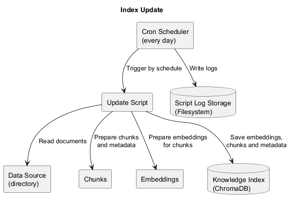

# Задание 6

Реализован [скрипт](update_index.py) для обновления базы знаний.

## Регулярный запуск

Скрипт предполагается запускать раз в день.

Для регулярного запуска в системе необходимо соответствующим образом настроить правило cron.

Команда `crontab -e` откроет редактор файла, содержащего все правила пользователя. Необходимо добавить в этот файл
строку:

```cronexp
0 0 * * * cd /home/app && /usr/bin/env python3 update_index.py >> /var/log/update_index.log 2>&1
```

Обновление индекса будет запускаться каждый день в 00:00.

## Фильтрация старых документов

Новые файлы ищутся в директории `docs`. Для того чтобы не тратить время и ресурсы на проверку уже обработанных
документов, реализована проверка времени создания/изменения для файлов. Обрабатываются только документы, которые были
изменены менее суток назад.

## Пример работы

В директорию `docs` добавим новый документ со следующим текстом:

```markdown
# Kail Vorin

## Photonaxe

Kael Vorin's had a blue-colored photonaxe.
```

Запустим скрипт обновления индекса. Результат его работы:

```text
Start time: 2026-06-05 20:20:31.514676.
End time: 2026-06-05 20:20:31.670737.
Number of added chunks: 1.
Total chunks in DB: 3783.
Total errors: 0.
```

Пример запроса после обновления БД:

```markdown
Question: What color was Kael Vorin's photonaxe?

Answer:

Step-by-step reasoning:

1. I will search the provided documents for information regarding Kael Vorin's photonaxe color.
2. Document 1 states: "Kael Vorin's had a blue-colored photonaxe."
3. This document directly answers the user's question.

Kael Vorin's photonaxe was blue-colored.
```

[](diagram.puml)
