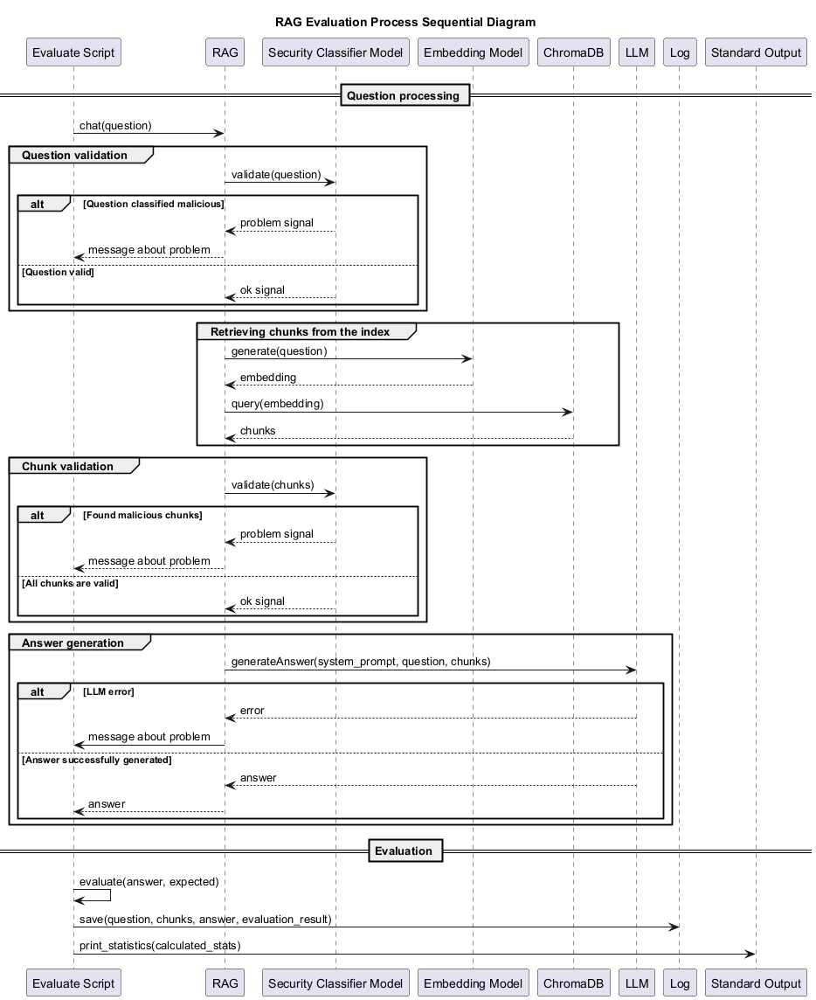

# Задание 7

Реализован [скрипт](evaluate.py) для оценки работы RAG при помощи "золотого набора" вопросов.

В полноценном промышленном приложении стоило бы выводить логи в стандартный поток вывода для дальнейшего сбора отдельной
системой. В рамках задания для удобства реализуем сохранение логов в CSV файл.

"Золотой набор" вопросов можно найти в [файле](golden_questions.json). В него включены вопросы трех категорий:
корректные с существующими данными, корректные с отсутствующими данными, и подозрительные запросы, которые должны быть
отфильтрованы системой безопасности.

Результаты работы скрипта можно найти в [файле](logs.csv).

## Анализ статистики

Статистика следующая:

```text
Found but should not be: 0
Not found but should be: 1
Rejected but should not be: 0
Not rejected but should be: 0
Total mistakes: 1
Total questions: 11
Mistakes percent: 9.09%
```

RAG, в целом, отрабатывает корректно, но есть одна ошибка.

Система не может найти ответ на вопрос `Who was the strongest among the Medians?`. Тема `Medians` является ключевой для
нашей базы знаний, поэтому необходимо улучшить работу RAG.

Для выяснения причины проблемы можно обратиться к логам. В них видно, что RAG извлек корректные источники из базы.
Соответственно поиск по эмбеддингам отработал корректно.

Можно сделать вывод, что проблема в одном из или комбинации следующих элементов:

- Недостаточно данных в самой базе знаний. Можно добавить больше документов с релевантной информацией.
- Чанки имеют недостаточное перекрытие, из-за чего теряется связанность. Можно попробовать увеличить перекрытие.
- Retriever извлекает недостаточное количество чанков. Можно попробовать увеличить параметр `k`.
- LLM не справляется и галлюцинирует. Можно попробовать использовать версию LLM с большим количеством параметров или
  полностью другую модель.

### Диаграмма работы

[](diagram.puml)
